# Proyecto-WEB: VacationAsHome

Servicio web destinado a conectar a los clientes con los anfitriones(dueños de los alojamientos).El sistema será accesible a estos como un servicio web desde el cual podrá realizar reservas, consultar alojamientos y modificar precios de sus alojamietos a través de este, tal y como se detalla en el enunciado de la práctica. 

## Landing e Inicio Sesión

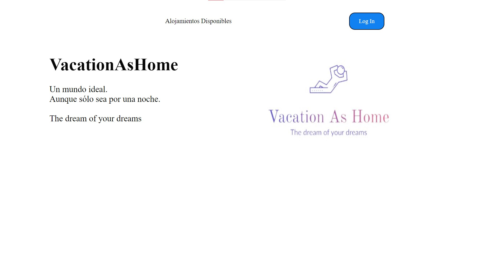

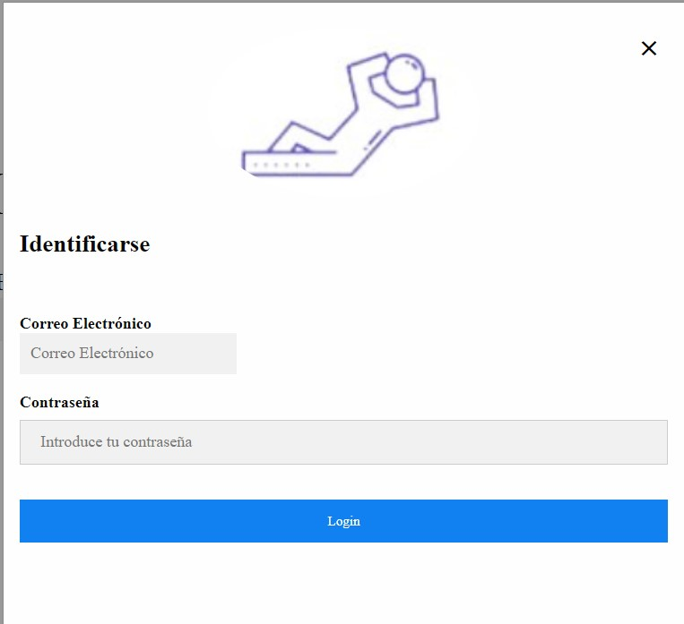

## Consultar Disponibles (según tipo usuario)

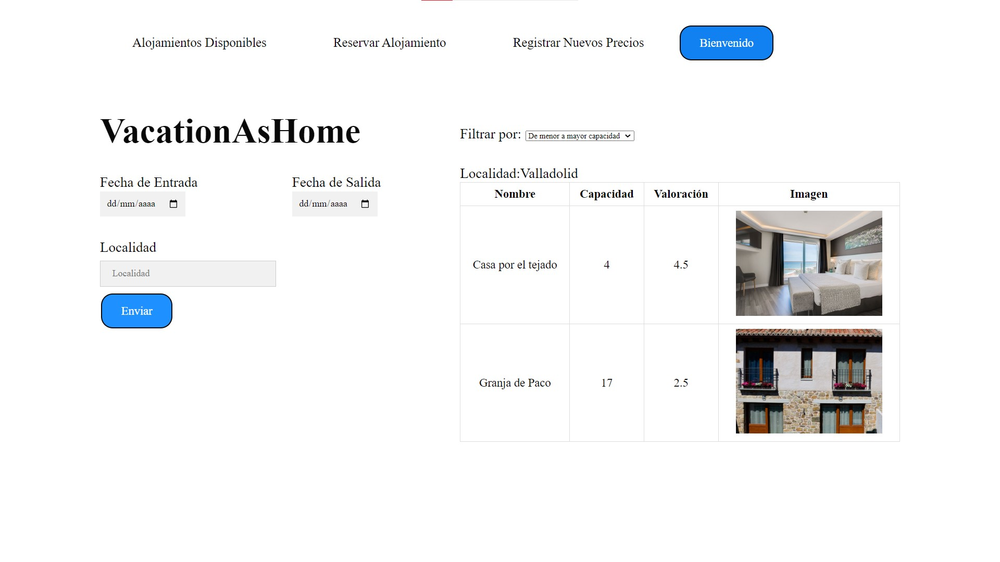

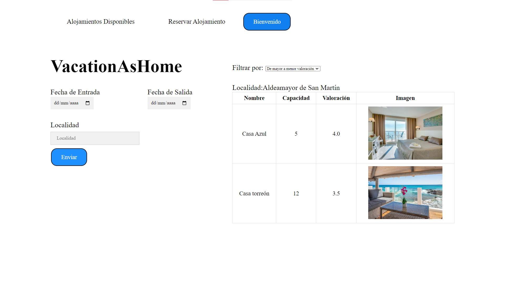

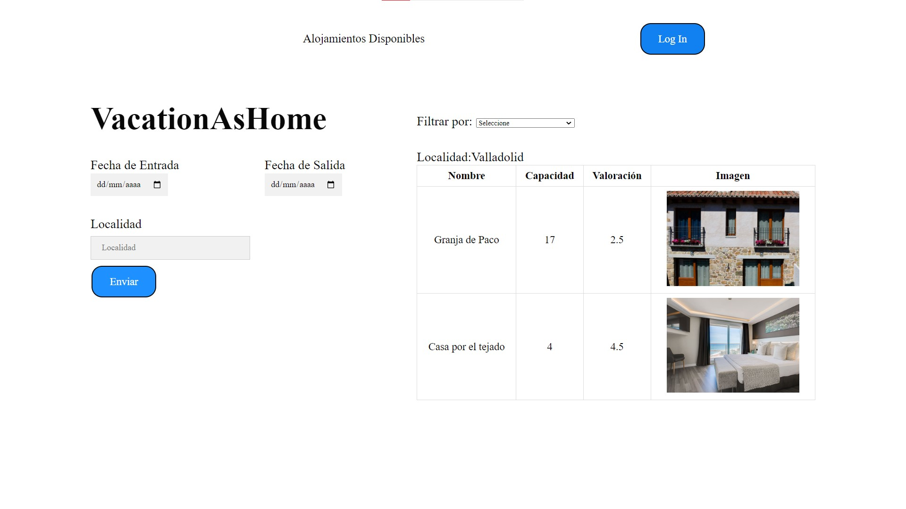

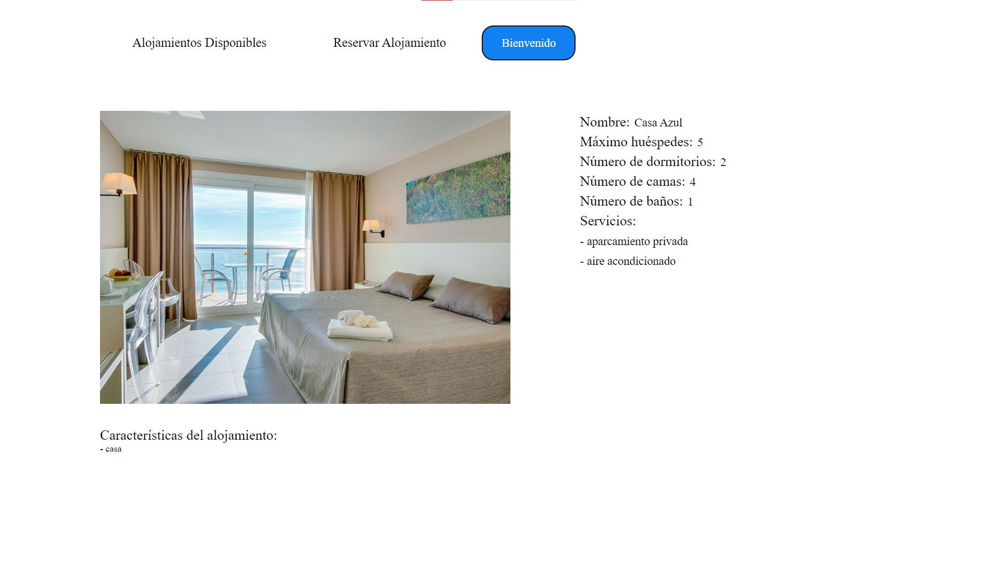

## Reservar (según tipo usuario)

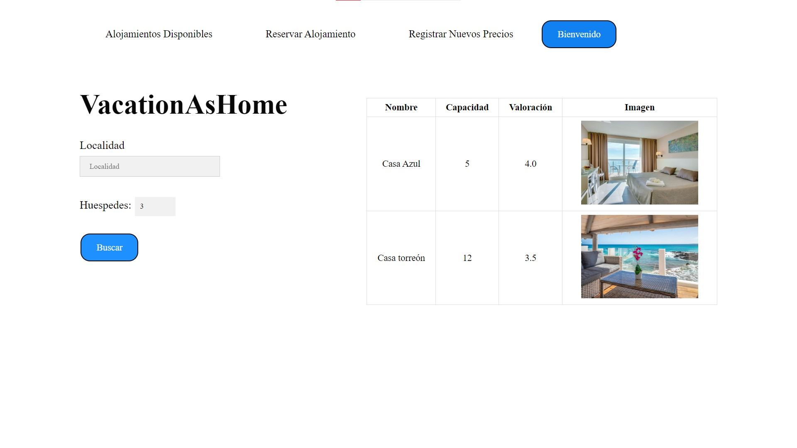

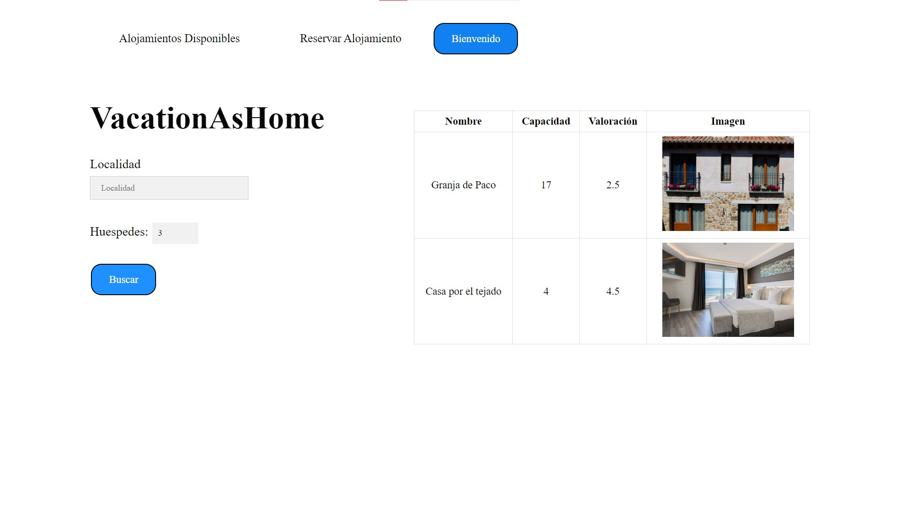

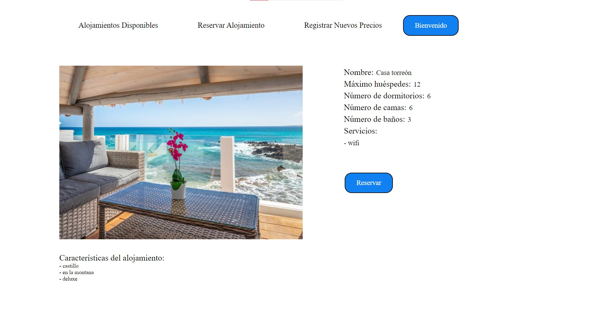

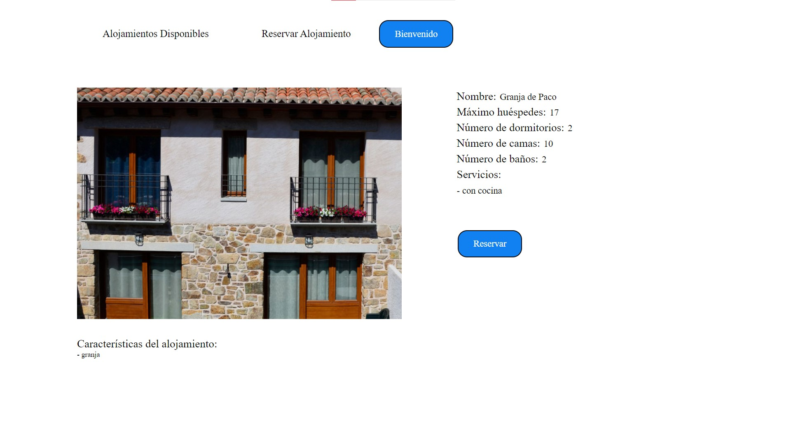

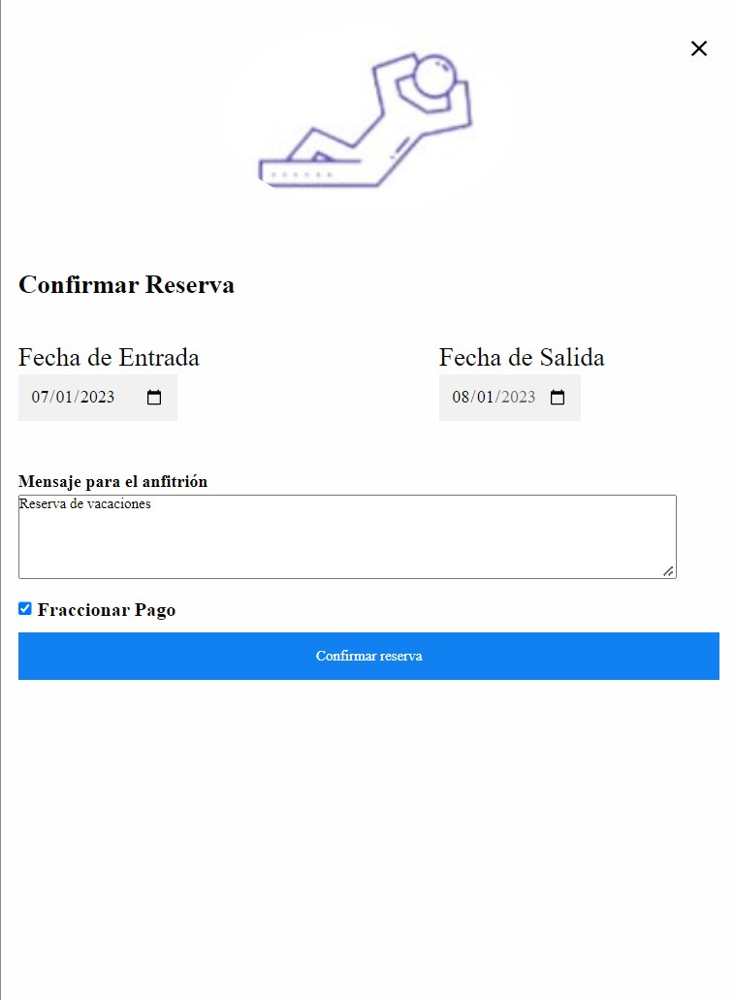

## Registrar precios

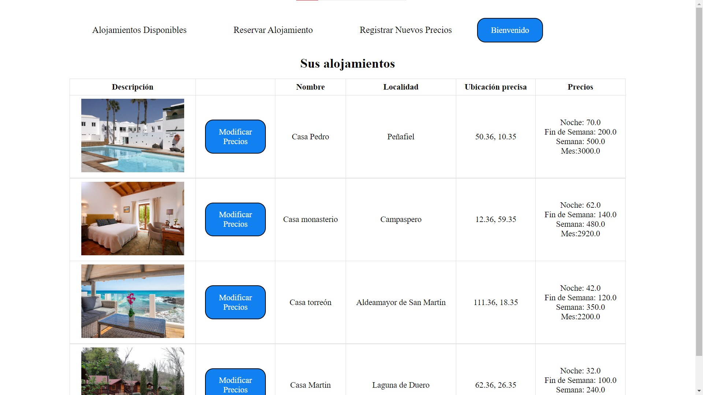

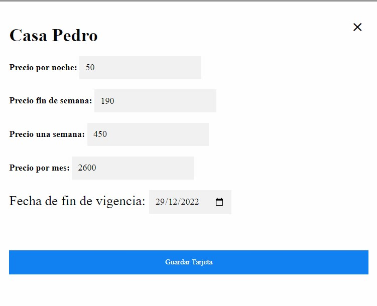
